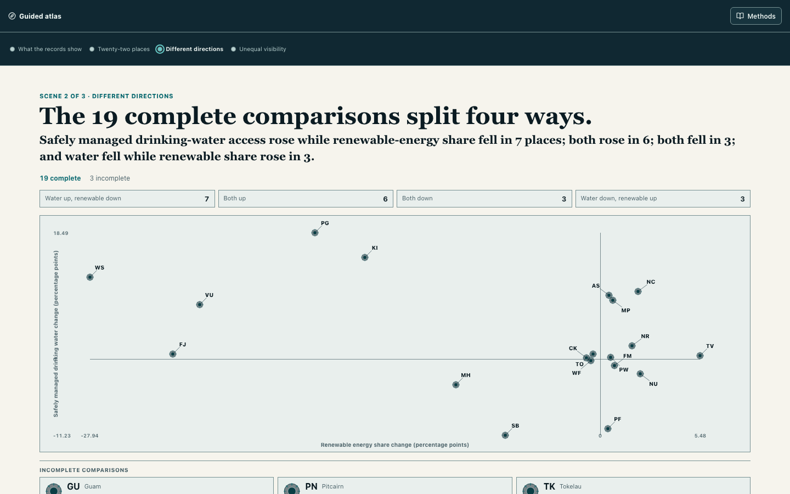

# Pacific Climate Evidence Atlas

**How conditions and official records differ across 22 Pacific places.**

Across the 19 places with comparable records, safely managed drinking-water access and renewable-energy share moved in four different directions. Across the wider 22-place field, the official record itself is uneven. This interactive atlas shows both, then lets readers inspect each place, its sources, and the gaps behind the comparison.

Built for the [2026 Pacific Dataviz Challenge](https://pacificdatavizchallenge.org/) climate theme.



## What the atlas shows

Regional summaries can suggest that the Pacific is moving along one shared path. The reviewed records do not support that simplification.

Among the 19 places with both measures, first-to-latest changes divide into four groups:

| Safely managed drinking-water access | Renewable-energy share | Places |
| --- | --- | ---: |
| Increased | Decreased | 7 |
| Increased | Increased | 6 |
| Decreased | Decreased | 3 |
| Decreased | Increased | 3 |

Guam, Pitcairn, and Tokelau remain visible but do not have a complete comparison for both measures. The chart therefore presents several regional directions, not a single Pacific trajectory.

The second part of the story asks a different question: what can the reviewed official data show? Across 22 places and 14 dataset positions, the atlas found 277 present positions and 31 absent positions. Coverage also differs sharply by subject: direct disaster-loss records appear for 12 of 22 places, monitoring-network and power-generation records for 18, safely managed drinking-water records for 19, and renewable-energy records for 20.

These are measures of reviewed record presence. They are not measures of data quality, local knowledge, infrastructure, readiness, need, or vulnerability.

## How to read the story

The guided experience has three movements:

1. **Different directions.** All 22 places stay in view while the 19 complete comparisons separate according to their observed water and renewable-energy changes.
2. **Unequal visibility.** The same regional field becomes a record-coverage view, making absent official rows visible instead of hiding them in a footnote.
3. **Place-by-place exploration.** Readers can select any place, examine its regional position, trace the underlying evidence, change analytical layers, and open the source and method notes.

The story deliberately keeps conditions and record visibility separate. It does not combine them into a new score or imply that missing data explains the observed changes.

## Explore the evidence

The map is both the storytelling surface and the exploratory interface. In Explore mode, readers can:

- select any of the 22 Pacific places without treating land area as a measure of importance;
- compare a place with the observed regional distributions;
- inspect indicator values, years, source links, and missingness;
- switch among coverage, pressure, capacity, gap, rank-sensitivity, and outlook views;
- compare the selected place with nearby evidence profiles based on record patterns, not geography or causality;
- share a view through URL-encoded map and panel state;
- use keyboard navigation, reduced-motion behavior, and responsive desktop or mobile layouts.

The optional **Adaptation Gap Index** is an exploratory screen for comparing climate-pressure signals with available capacity proxies. It is not the opening argument and should not be read as a definitive ranking of need, preparedness, or vulnerability.

## Data and method

The project uses datasets published through the Pacific Data Hub and assembled for the challenge. The complete source inventory is in [`research/official_datasets_2026.csv`](research/official_datasets_2026.csv), and machine-readable contracts document the filters, grain, units, provenance, and limitations of each processed source in [`data/contracts/`](data/contracts/).

| View | Method | Responsible interpretation |
| --- | --- | --- |
| Water and renewable-energy movement | Keep the first and latest available value for each geography; calculate signed percentage-point change; display a place in the two-axis field only when both measures are present. | Endpoints are not continuous trajectories. The two indicators have different meanings, denominators, and time spans, and neither establishes causality. |
| Official-record visibility | Check whether a reviewed row exists for every place across 14 processed datasets, producing 308 place-dataset positions. | Presence does not establish completeness, currency, quality, representativeness, or conditions on the ground. An absent row is not a zero. |
| Adaptation Gap Index | Rank each latest available indicator within the observed Pacific field, average pressure and capacity proxies separately, then rescale their difference to 0–100. | A comparative screen whose result depends on available indicators, years, and equal-weight choices—not an absolute risk or needs assessment. |
| Evidence-profile similarity | Compare selected-place record patterns with Jensen–Shannon divergence. | Similarity in the reviewed evidence profile does not mean geographic, cultural, causal, or policy similarity. |
| Outlook | Fit simple trends where time-series coverage is sufficient and compare transparent capacity scenarios. | A stress test for exploration, not a forecast. |

Detailed definitions and limitations are documented in the [methodology](context/docs/methodology.md), [data card](context/DATA_CARD.md), and [model card](context/MODEL_CARD.md). Generated summary counts are recorded in [`artifacts/provenance/app_data_summary.json`](artifacts/provenance/app_data_summary.json).

## Interpretation limits

- First-to-latest comparisons can hide changes between their endpoints.
- Years differ by place and indicator; the interface preserves them rather than implying a common observation date.
- Missing official rows do not mean missing infrastructure, absent events, low readiness, or low need.
- Capacity indicators are proxies and cannot represent the full range of local adaptation knowledge or action.
- Rank order is sensitive to indicator availability and analytical choices.
- Selectable records use centroids. Natural Earth land geometry provides visual context, not reviewed political or territorial boundaries.

## Run locally

The application is a static React, TypeScript, Vite, and MapLibre project. It uses generated local data and requires no backend or API key.

```bash
git clone https://github.com/sardorsob/Pacific-Climate-Gap-Atlas.git
cd Pacific-Climate-Gap-Atlas
python -m pip install -e .
npm install
npm run app:dev
```

Create and preview a production build:

```bash
npm run app:build
npm run app:preview
```

Vite writes the static production bundle to `app/dist/`.

## Reproduce the analysis

The main data pipeline is script-based and configuration-driven:

```bash
python scripts/profile_datasets.py --config configs/datasets.yml
python scripts/make_dataset.py --config configs/datasets.yml
python scripts/build_gap_index.py --config configs/gap_index.yml
python scripts/run_outlook.py --config configs/outlook.yml
python scripts/run_eda.py --config configs/eda.yml
python scripts/build_app_data.py
python scripts/build_land_context.py
python scripts/validate_data_contracts.py
```

Run the repository checks:

```bash
python -m pytest -q
npm --prefix app run test
python scripts/check_required_artifacts.py
python scripts/check_secrets.py
```

## Repository guide

```text
analysis/      Reusable Python processing, scoring, modeling, and EDA code
app/           React, TypeScript, Vite, and MapLibre atlas
artifacts/     Generated figures, tables, provenance, and design evidence
configs/       Dataset, index, outlook, and EDA configuration
context/       Research, methodology, data, model, story, and design documentation
data/          Raw cache, processed observations, contracts, and app-ready exports
research/      Challenge brief, official dataset inventory, and reference research
scripts/       Reproducible command-line entry points
tests/         Python tests for analytical helpers and data behavior
```

## Sources and attribution

- Official statistical data: [Pacific Data Hub](https://pacificdata.org/) and the source links preserved in the project inventory and contracts.
- Land context: [Natural Earth](https://www.naturalearthdata.com/), used for visual orientation.
- Interactive mapping: [MapLibre GL JS](https://maplibre.org/maplibre-gl-js/docs/).
- Competition: [Pacific Dataviz Challenge 2026](https://pacificdatavizchallenge.org/).

The atlas is designed to make comparison possible without turning uncertainty into certainty. Its central claim is modest: Pacific conditions do not move in one direction, and the records used to describe them do not illuminate every place equally.
